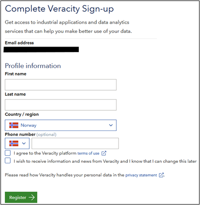
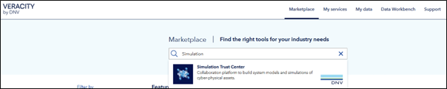
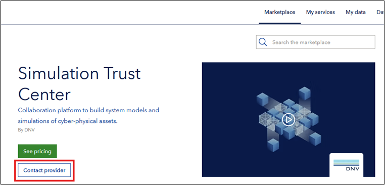
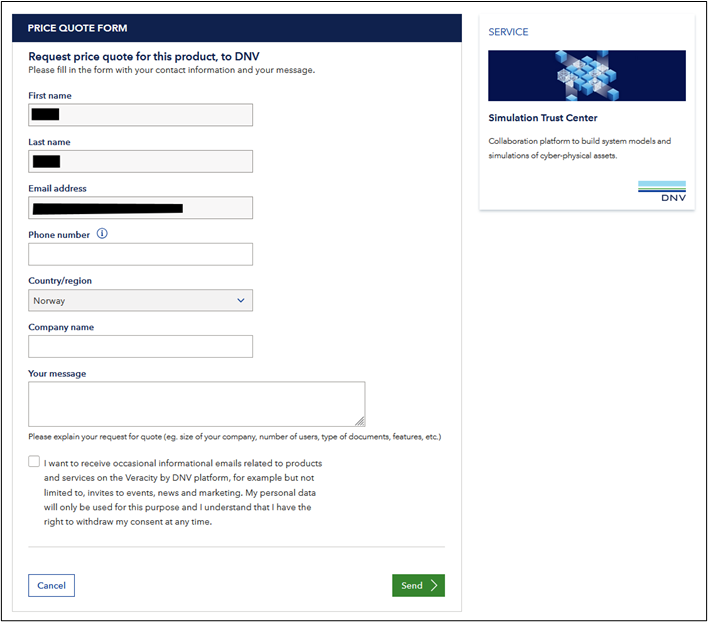
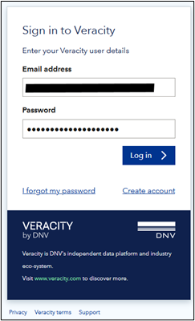
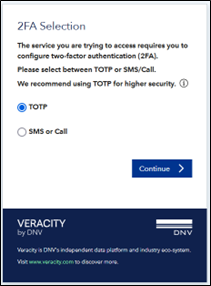

# Creating an STC account

## 1. Creating a veracity account

Simulation Trust Center (STC) users are granted access to STC via Veracity, which is DNV’s cloud platform. To create a Veracity account, open a web browser of your choice and navigate to https://www.veracity.com/. Create an account by clicking `Create Account` link on top left of the website as shown below.

Type in your email address and password and click “Sign up”. You will receive an email verification email with a link. Continue registration by clicking the link, which will navigate you to the page shown below.

Once registered, you can sign in to your Veracity account.

## 2. Requesting access to STC

On Veracity website, click `Marketplace` in top navigation, and state type in `Simulation Trust Center`. Click the link to the service in the dropdown menu shown below.

On Simulation Trust Center Marketplace page, click `contact provider` followed by `Request quote` link.

You will be given `Price Quote Form` as shown below. Type in your group name for `Company name` and a text UQChallenge participants for `Your message`. Click `Send` to complete registration. 

## Request user access to STC
Login to STC by navigating to https://stc.dnv.com/. Type in your email address and password as shown below.

You will be asked to register two-factor authentication via an authenticator app or via your phone number as shown below.

Once authentication is done, and if this is first time you are trying to login to STC, you will be given a text notice indicating that the access request has been delivered to STC administrators. You will receive an email notification once the request is granted.

Once the request is granted, browse https://stc.dnv.com again where you will be given a page to accept terms and conditions for using Veracity and STC.

## 4. Using STC

Once STC access is granted you can proceed to log into the platform and run simulations. Please follow [this tutorial](/USING_STC.md)
