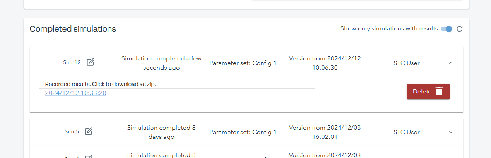

<div style="display:flex; flex-direction:row; gap:10px;">
  
  
</div>

## Post-processing Simulation Trust Center results
After you simulate in STC, you'll be able to download a zip file that contains the time-series results of your simulation.

To learn how to simulate in STC please follow this guide [here](USING_STC.md)

### 1. Download the zipped results
Navigate to your STC project and go to the simulations page. Once there, check out the completed simulations section. After you've successfully simulated and terminated the simulator you should be able to see a list of simulations.



Click your simulation to expand and download the recorded results.

### 2. Unzip the file
After unzipping you'll find a CSV file with the time-series data from the model and other files used in the simulation.


### 3. Post-processing script
Now, we can proceed to load the CSV time-series using Python so that we can run some post-processing tasks. For example:

```python
import pandas as pd

# Specify columns you want to import
columns_to_import = ['y1', 'y2', 'y3', 'y4', 'y5', 'y6', 'sample_no']

# Read the CSV file with these columns, skipping the first row after the header as this is always zero
df = pd.read_csv('path/to/UQChallenge20251.csv', usecols=columns_to_import, skiprows=[1])

# Check number of samples in the generated dataset
sample_indices = df['sample_no'].unique()  # Extract unique sample indices
num_samples = len(sample_indices)
df = df.drop(columns=['sample_no'])  # Drop the sample index column

# Convert and reshape DataFrame to a NumPy array of the desired 3D shape (num_time_steps x num_features x num_samples)
Y_out = df.to_numpy().reshape(num_samples, 60, 6).transpose(1, 2, 0)

# Example:  Print the First Time Step for All 6 Output Features of Sample 1
print('Output values for the first timestep for all 6 features of sample 1:')
print(Y_out[0, :, 0])
```