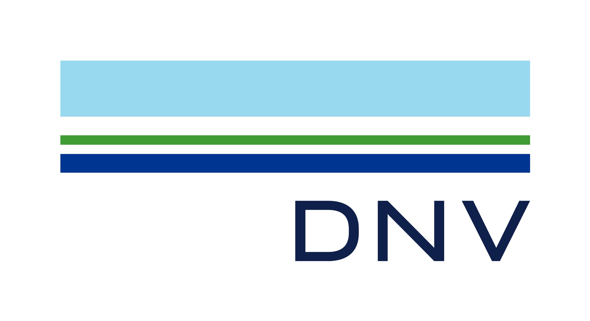

# The NASA and DNV Challenge on Optimization Under Uncertainty  
<p align="center">
    
    
</p>

The 2025 UQ Challenge presents a problem designed to bring researchers together to tackle a problem common to many complex real-world systems. 

The challenge will run from January 6th to March 31st, 2025, and accepted responses will be part of a special session at the [ESREL 2025 conference](https://esrel2025.com/) in Stavanger, Norway, from June 15th to 19th. The information needed to take part in the challenge is given below.  

## Table of Contents
- [Motivation](#motivation)
- [Register for the 2025 UQ Challenge](#-register-for-the-2025-uq-challenge)
- [Timeline](#-timeline)
- [Problem description](#problem-description)
- [How to access the local computational model](#how-to-access-the-local-computational-model)
- [How to generate data from the real system](#how-to-generate-data-from-the-real-system)
- [How to submit numerical results](#how-to-submit-numerical-results)
- [Questions and Answers](#questions-and-answers-updated-as-new-questions-arrive)

## Motivation
NASA missions often involve the development of new vehicles and systems that must be designed to operate in harsh domains with a wide array of operating conditions. Similarly, DNV works to safeguard life, property, and the environment across a range of industries by ensuring that complex engineered systems can be trusted to operate reliably, even during rare and extreme events. DNV collaborates across various sectors to address the challenges of designing and operating safety-critical systems.

Both NASA and DNV deal with high-consequence and safety-critical systems for which quantitative data is either very sparse or prohibitively expensive to collect. Limited heritage data may exist, but is also usually sparse and may not be directly applicable to the system of interest, making Uncertainty Quantification (UQ) extremely challenging.

Recognizing the shared challenges in UQ across different sectors, NASA Langley Research Center and DNV Group Research and Development have developed a challenge problem to unite a community of researchers toward common goals. While the problem formulation is presented in a discipline-independent framework, the underlying application is consistent with the complexities of realistic systems. This collaborative effort aims to advance methodologies in UQ that are broadly applicable, enhancing safety and reliability across various domains.

This challenge aims to advance research within:
- Modeling and refinement of uncertainty given sparse data
- Propagation of mixed aleatory and epistemic uncertainties through system models
- Design optimization in the presence of uncertainty

## ✒️ Register for the 2025 UQ Challenge
Each participating group should first register by sending an email to [uqchallenge@dnv.com](mailto:uqchallenge@dnv.com) including the name of all the participants, their email addresses, and affiliations. Please also indicate who will be the point of contact for the group.

Accepted responses to the challenge will be part of a dedicated session of the [ESREL 2025 conference](https://esrel2025.com/) to be held in Stavanger, Norway, from 15-19 June 2025. Registration to the conference is done separately through the conference website.

## ⌚ Timeline
- **December 27th:** Deadline for registering new teams  
- **January 6th:** Start of challenge. Access to simulation models and data will be opened.  
- **March 17th:** First paper deadline. We aim to review and provide feedback to each team within 1 week (by March 24th).  
- **March 31st:** Deadline for submitting numerical results. See [How to submit numerical results](#how-to-submit-numerical-results).
- **April 10th:** Deadline for camera-ready paper.

See also [https://esrel2025.com/](https://esrel2025.com/) for deadlines regarding conference registration.

## Problem description
The official problem description can be found on the NASA website [here](https://uqtools.larc.nasa.gov/the-nasa-and-dnv-challenge-on-optimization-under-uncertainty/).

## How to access the local computational model 
**Link to local simulation model:** *Will be available January 6th.*

The simulation model will take as input a vector $\textbf{X} = (\textbf{X}_a, \textbf{X}_e, \textbf{X}_c, \omega)$, consisting of aleatory, epistemic, and control variables with dimensionalities $n_a = 2$, $n_e = 3$, and $n_c = 3$, respectively. Additionally, there is an aleatory variable $\omega$ representing the random seed.

TODO: explain that the model is a binary. Example of how to run from matlab and python given below. 

```python
# Include code to run model from python.. 
import something
```

```matlab
% Include code to run model from matlab..
function abc
  % [...]
end
```

## How to generate data from the real system
Each participating team will get access to an online solution for generating (synthetic) data from the real system with the control parameter $X_c$ they specify. 

TODO: include guidance on this. include STC logo and screenshot of the tool.

## How to submit numerical results
To submit the numerical results, please see the example in [results_template](./results_template/). 

The UMs should be submitted through csv files with generated samples. Everything else can be included in the provided results.json file. 

## Questions and Answers (updated as new questions arrive)
Answers to any questions we receive that are relevant for all respondents will be posted below or [here](https://uqtools.larc.nasa.gov/the-nasa-and-dnv-challenge-on-optimization-under-uncertainty/).
