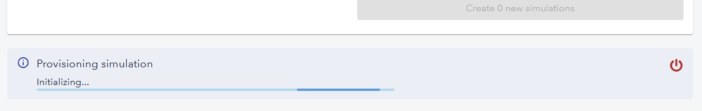
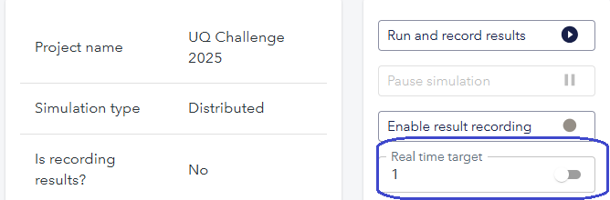

  
  

## Using DNV's Simulation Trust Center
Once you gain access to STC, please follow these instructions to run the simulations:

### 1. Log in to STC with your veracity account.

Navigate to [STC](https://stc.dnv.com/), the platform will automatically redirect you to log in with your Veracity account.

### 2. Find the UQ challenge project

After successfully inputting your credentials, Veracity will redirect you back to STC. Once there, you can proceed to look for the UQ Challenge project that we have setup for your account. You should be able to find it the projects section in the main page:

If you can't find the project please reach to the STC team at stc-support@dnv.com

### 3. Setting control inputs

**The control inputs should always be set before starting a simulation**, to do this click on the project's card (the one displayed in the previous step). Once in the project, proceed to navigate to simulation parameters:

In the simulation parameters view, click on the simulation model called "UQChallenge2025" to open the model variables and click on "Parameters". You'll then be displayed with the three control inputs that you can set. Proceed to input decimal values in the range of 0 - 1, values outside of this range will be automatically clipped by the simulation model.

### 4. Save the project

**Saving the project is really important!**, otherwise the control inputs that you just input will not be used when you run a simulation. To save the project just click "Save project" in the top right corner:

### 5. Provisioning a simulation

After you've successfully saved the project, proceed to navigate to the simulations page:

From here, you'll be able to see how many simulations you have left. You can also start a simulation instance by checking the "Config 1" parameter set and clicking "Create 1 new simulation". Afterwards, STC will start to provision the necessary resources for running the simulation, this may take a few minutes:

*Note*: If the simulator takes more than 5 minutes to provision please reach out to the STC team. Also, the simulation won't be counted until you actually start simulating.

### 6. Running a simulation

Once the simulator has been initialized, click on it:

This will take you to the simulator overview, where you can start running the simulation. To do this, click on "Run and record results":

*Note*: By default the simulation will run in real-time, however you can speed it up by disabling real-time. Simulation will then proceed to run as fast as possible limited to compute power. T disable real-time just toggle it off in the simulations overview page:

### 7. Terminate simulator

To be able to download the results, proceed to end the simulation after it finishes by clicking the "End simulation" button:

The simulator will then take a few seconds to terminate:

Afterwards, you'll find the simulation in the completed simulations section, click on it to display the link to download the time-series results in the form a CSV file:

To test new control inputs, follow these steps again and don't forget to save your project changes!

## Important notes

- As mentioned previously, the simulation count will only be decreased when you start simulating, so if any errors occur while allocating resources for the simulator, your acount shouldn't be affected.
- STC allows you to change signal values while simulating, however this won't be useful as the control inputs are only used when starting the simulation.
- You can download the results as many times as you want.
- You'll lose access to STC on the 1st of April 2025.
- If you happened to encounter an error when running a simulation, please reach out to the team ASAP and don't run any subsequent simulations.

## Contact

If by any chance, you happen to struggle using the platform or if something isn't working as expected, feel free to use these contact details to get some support:

- STC Team (stc-support@dnv.com)
- Christian Agrell (christian.agrell@dnv.com)
- Vegard Flovik (vegard.flovik@dnv.com)
